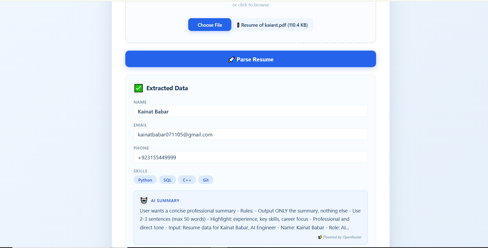

# 📄 Resume OCR & ETL Pipeline with AI Summary

## 🚀 Overview

This is a **full-stack Resume OCR & ETL Pipeline** that extracts key information from resumes (PDF/Images), generates an AI-powered professional summary, and automatically stores the data in a PostgreSQL database.

### ✨ Key Features

- 📤 **Drag & Drop Upload** – Beautiful Blue-White themed UI
- 🔍 **OCR Integration** – Reads scanned images using OCR.space API
- 🧠 **AI Summary** – Generates professional 2-3 sentence summaries using OpenRouter (free models)
- 📊 **Auto-Save to Database** – Every parsed resume is automatically saved to `all_resume` table
- 🏷️ **Skill Extraction** – Identifies and displays skills as tags
- 📁 **Local Scraper** – Optional public job board scraper

---

## 🖥️ Screenshot

Here's how the application looks in action:

---

## 🛠️ Tech Stack

| Component | Technology |
| :--- | :--- |
| **Backend** | Python, Flask (Port 5001) |
| **Frontend** | Next.js, React (Port 3000) |
| **OCR** | OCR.space API (Free Tier) |
| **AI Summary** | OpenRouter API (Google Gemini / Mistral / Llama) |
| **Database** | PostgreSQL |
| **Scraping** | BeautifulSoup (Local) |
| **Deployment** | Vercel (Optional) |

---

## 📁 Project Structure
